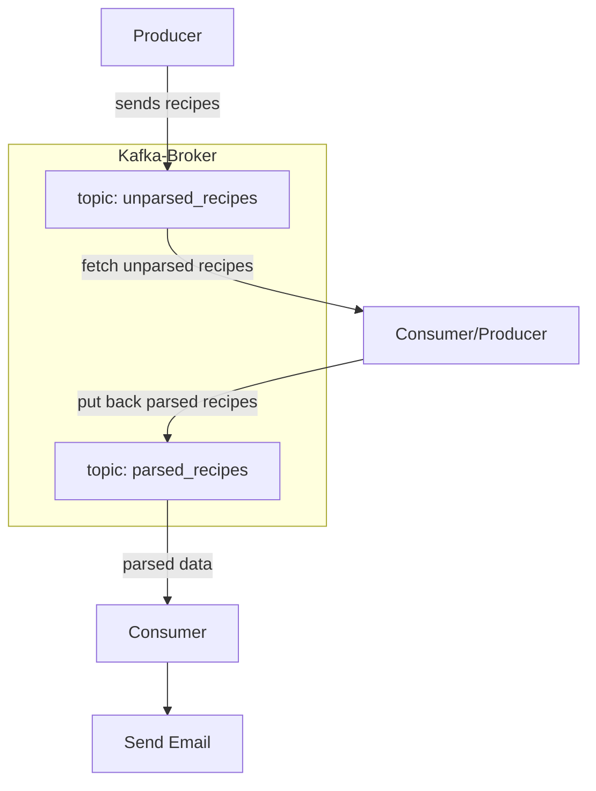

# kafka-recipe-alert
This is an alert system using Apache Kafka which will send Email notifications to the subscribed user about the recipes,
if it doesn't meet the threshold calorie value.


Built With:
* Apache kafka: 3.0.0 
* Python:3.12
* GMAIL API

## Install
1. Install Java JDK and Apache kafka with Zookeeper [refer doc here](https://learn.conduktor.io/kafka/how-to-install-apache-kafka-on-mac/)
2. Start zookeeper server and kafka server
3. Create OAuth client ID in APIs& Services of Google cloud console and download the key and save it as credentials.json in the project root folder.
### Running the project
1. Install requirements.txt using ```pip install -r requirements.txt```
2. Run the scripts producer, consumer and consumer_notification
